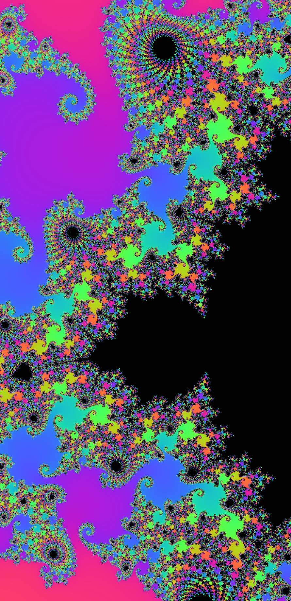

# Mandelbrot Explorer (UltraDeep)

## Live Demo
- [Open the app](https://masato-nasu.github.io/Mandelbrot-Explorer-2/)

ブラウザで動く **マンデルブロ集合エクスプローラー**です。フルスクリーンのキャンバス上でパン／ズームしながら探索し、**高画質のスクリーンショット保存（📷 撮影）**や、超深度向けの **DeepNav** モードを備えています。

---

## 特徴

- **フルスクリーン描画**：`canvas` 1枚で全画面レンダリング
- **操作パネル**：Reset／ズーム±／📷 撮影／DeepNav／スマホモード切替
- **ヘルプ（？）**：右下の「？」ボタンから操作ガイド表示（常時表示）
- **DeepNav バッジ**：DeepNav の状態を画面下部にバッジ表示（OFF / standby / ON）
- **PWA 対応**：`manifest.json` とアイコン参照を用意（ホーム画面追加向け）
- **エラー可視化**：実行時エラー／Promise 例外を画面下部のエラーボックスに表示

---

## 操作方法

- **ドラッグ**：移動（パン）
- **クリック**：中心合わせ
- **ダブルクリック**：中心合わせ＋ズームイン
- **📷 撮影**：現在の画面を高画質で画像保存
- **DeepNav**：超深度対応モード
- **Reset**：初期位置へ

### PC
- **ホイール**：ズーム
- **左ドラッグ**：移動（パン）

### スマホ
- **1本指ドラッグ**：移動（パン）
- **＋／− ボタン**：ズーム
- 端末が重い場合は「**スマホモード**」をONにしてください

---

## UIパネル（右上）

- **スマホモード**：スマホ向け軽量設定
- **Reset / 📷 撮影**
- **ズーム（− / ＋）**
- **DeepNav / 常時ON**
- **詳細設定（Advanced）**：Res / Step / Iter / Bits / AutoBits / Preview / AutoSettle など

> ※各パラメータの意味は `app.js` 側の実装に依存します（本READMEはUI側の使い方中心です）

---
